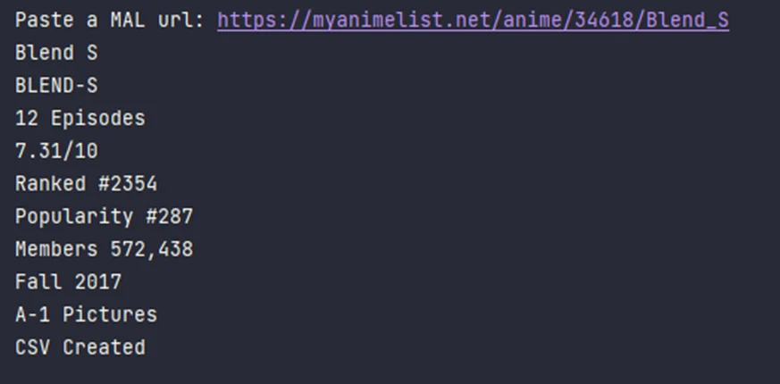
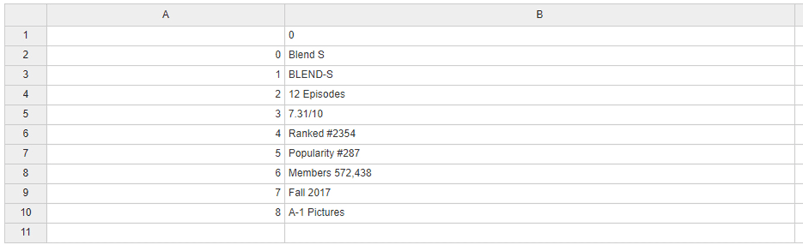

# MyAnimeList-Web-Scraping-with-BeautifulSoup
A Web Scraper created with Python and Beautiful Soup.

It scrapes information from a MAL page and displays it on the terminal.
It also creates a CSV file containing all the scraped information.

Just paste the Anime url and press enter.

You will get information like Name, Score, Rank, Popularity, Number of Episodes, Studio, Season, etc.
